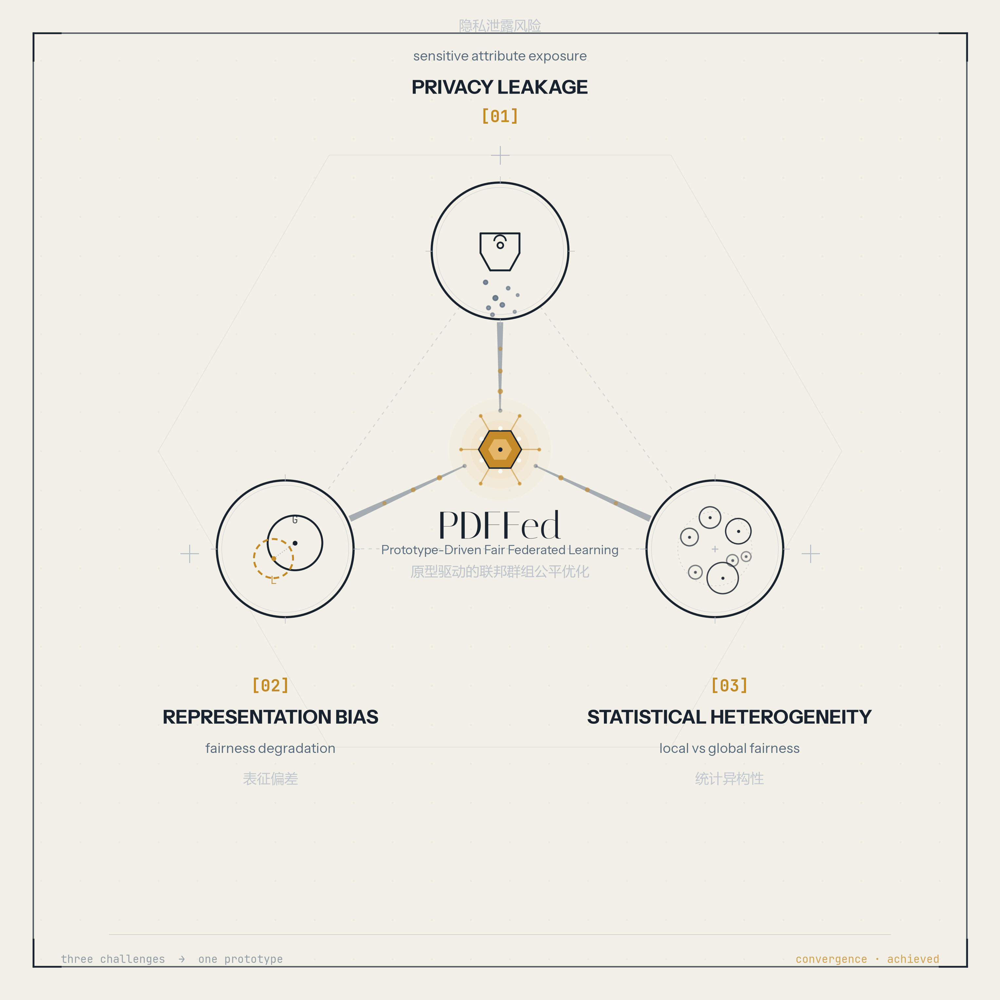

---
🌐 **语言选择 / Language**

| 中文 (Chinese) | 英文 (English) |
|---------------|----------------|
| 📖 [README_CN.md](README_CN.md) | 📖 [README.md](README.md) |

**中文优先 / Chinese First** — 推荐先阅读中文版文档

---

<p align="center">
  
</p>

<p align="center">
  <strong>PDFFed</strong> 通过统一的<em>原型驱动</em>机制,应对异构联邦学习中的三大开放挑战:
  敏感属性交换带来的隐私泄露、表征偏差导致的公平性退化,以及统计异构下局部与全局公平性之间的鸿沟。
</p>

---

# Fairness Federated Learning Framework

> 通用联邦学习群组公平性研究框架 | 28+ 算法 | 3 类任务 | 10 个数据集 | 全链路工程优化

---

## 目录

- [项目概览](#项目概览)
- [工程化优化清单](#工程化优化清单)
- [小白快速上手教程](#小白快速上手教程)
- [项目结构](#项目结构)
- [算法列表](#算法列表)
- [数据集](#数据集)
- [进阶用法](#进阶用法)
- [引用](#引用)

---

## 项目概览

你在做一个**联邦学习公平性（Fairness-aware Federated Learning）**的研究，需要跑大量对比实验：

- 10+ 个基线算法 vs 你的方法
- 10 个数据集，分别有表格 / 图像 / 文本三类模态
- 4 种数据划分策略（Uniform、Dirichlet 0.1/0.5/1.0），3 种客户端规模（20/30/40）
- 每组实验重复 3 次取 Mean ± STD
- 算力来源多样：本地 4090/5090、租来的 P4 机器、实验室公用服务器

**这个框架就是为此而生的。** 它不是"跑通就行"的实验脚本，而是经过了大量工程化打磨的生产级实验系统。

### 核心数据一览

| 维度 | 数量 |
|------|------|
| 算法总数 | 28+（23 个活跃 + 备用） |
| 公平 FL 算法 | 13 个 |
| 标准 FL 基线 | 6 个 |
| 单轮 FL 算法 | 3 个 |
| 任务类型 | 表格分类 / 图像分类 / 文本分类 |
| 数据集 | 10 个 |
| 模型架构 | BERT / CNN / ANN / LogisticRegression |

---

## 工程化优化清单

以下每一项都是在实际大规模实验中被逼出来的工程解法，不是花架子。

### 1. AMP 自动混合精度 — 智能硬件适配

- **自动检测 GPU 算力**（Compute Capability）：CC >= 7.0（V100/T4/2080/A100/4090/5090 等）自动启用 FP16 混合精度训练
- **P4 等老卡自动禁用**，不会炸显存
- **24 个算法全部统一接入**，不管走哪个 main 入口、是否用 `run_experiments`，AMP 都在 `Experiment()` 入口层统一解析 `param_dict['use_amp']`（支持 `True`/`False`/`"auto"`）
- 使用 PyTorch 内置 `torch.cuda.amp`，**无需额外安装任何包**
- 梯度累积 + GradScaler 正确联动
- 训练速度提升 1.5x–2x，显存节省 30%–50%

> 代码入口：[`tool/amp_utils.py`](tool/amp_utils.py)、[`experiment.py`](experiment.py) L502

### 2. 图像缓存 Stacked Tensor — 内存效率翻倍

- 旧方案：每个图像样本一个独立 Python dict，5000 个一组存在 `.pt` 文件里，读进来是 5000 个 dict 的 list
- 新方案：直接 `torch.stack` 成一个大 tensor（如 `[5000, 3, 224, 224]`），去掉 Python dict 开销
- 缓存加载速度提升约 **5 倍**，内存占用减少约 **50%**
- 覆盖所有图像数据集：CelebA / UTKFace / FairFace / LFWA+
- 旧缓存自动失效，程序自动重建

> 代码入口：[`module/dataset.py`](module/dataset.py) `_load_shards_stacked()`

### 3. 断点续训 — 按轮次 / 按重复实验精细管理

- 每轮通信结束自动保存 checkpoint，包含模型参数、优化器状态、随机种子、客户端选择历史
- 按 `Experiment_NO` + `repeat{N}` + `round_X` 三级命名：
  ```
  save_path/checkpoint_repeat0_round_5.pt
  save_path/checkpoint_repeat0_round_10.pt
  ```
- `resume` 模式自动扫描已完成轮次，精确从断点继续，**不会跳过未完成的重复实验**
- 支持 `clean_old_checkpoints()` 自动清理过期 checkpoint，节省磁盘

> 代码入口：[`tool/checkpoint.py`](tool/checkpoint.py)

### 4. torch.compile 模型编译加速

- **默认关闭**（opt-in），通过 `param_dict['use_compile'] = True` 启用
- BERT 文本任务自动使用 `mode="reduce-overhead"`，减少动态 seq_len 重编译
- CNN 图像任务使用默认 mode
- 表格小模型自动跳过（编译开销大于收益）
- 自动检测 PyTorch >= 2.0 是否可用，不可用则优雅降级

> 代码入口：[`module/experiment_setup.py`](module/experiment_setup.py) `Experiment_Create_model()`

### 5. 内存感知 DataLoader — 防止 OOM

- 运行时检测系统内存使用率：> 85% 时自动 `num_workers=0`，避免多进程 fork 导致的 Memory Error
- 智能判断 `pin_memory`（GPU 训练开启，CPU 训练关闭）
- 图像缓存构建使用 `ThreadPoolExecutor` 而非 `ProcessPoolExecutor`，线程共享内存避免爆炸
- `get_dataloader_config()` 一键获取最优 DataLoader 配置

> 代码入口：[`tool/memory_utils.py`](tool/memory_utils.py)

### 6. 分布式实验任务队列 — 多机协作

- 以 **GitHub 仓库** 作为中心协调节点（不需要 OSS/NAS）
- 逐任务锁文件 + 心跳机制，防止多机抢同一个实验
- 心跳超时自动回收（某台 P4 被清退后，其他机器自动接管）
- 贡献者注册 + 硬件信息上报 + 实验可复现性追踪（git hash、Python 版本、依赖列表）
- Worker 脚本支持后台心跳、云端 Checkpoint、SIGTERM 优雅退出

> 代码入口：[`tool/task_queue.py`](tool/task_queue.py)、[`tool/worker.py`](tool/worker.py)

### 7. 云存储抽象层 — 多后端无缝切换

- 统一接口，支持 4 种后端：本地文件系统 / 腾讯云 COS / 阿里云 OSS / AWS S3
- 通过配置文件或环境变量切换，凭证已加入 `.gitignore`
- 数据集和 checkpoint 自动在本地和云端之间同步

> 代码入口：[`tool/cloud_storage.py`](tool/cloud_storage.py)

### 8. GPU+CPU 混合并行调度器

- `run_experiments.py`：一个脚本启动全部实验矩阵
- 自动检测可用 GPU，按表格 → 图像 → 文本顺序调度
- 支持 GPU 和 CPU 混合并行槽位
- 重复实验（Mean ± STD）自动管理
- 已完成实验自动跳过（通过日志检测）

> 代码入口：[`run_experiments.py`](run_experiments.py)

### 9. 邮件通知

- 实验完成 / 失败后通过 QQ 邮箱 SMTP 发送通知
- 配置文件已排除出版本控制

> 代码入口：[`tool/notification.py`](tool/notification.py)

### 10. 协作者身份 & 贡献统计

- 每位协作者配置学术身份（姓名、邮箱、机构、Google Scholar、ORCID、OpenReview）
- 实验自动记录执行人、硬件信息、用时
- `contrib_stats.py` 提供算力贡献排行榜

> 代码入口：[`tool/user_config.py`](tool/user_config.py)、[`tool/contrib_stats.py`](tool/contrib_stats.py)

### 11. 通用实验入口 — 一套代码覆盖全场景

- 4 个 main 入口 + `run_experiments` 批量入口 + `Experiment()` 统一构造
- 不管怎么启动，AMP / compile / checkpoint / memory 等优化全部自动生效
- 新算法只需实现标准接口，自动接入整个实验体系

### 12. TensorBoard 深度监控 — 训练过程全透明

- 所有 22 个联邦学习算法全部接入 TensorBoard，训练过程实时可视化
- **基础指标**（每轮记录）：Accuracy、DEO、SPD、FR、HM、GPU 时间、通信成本
- **梯度监控**（基于 weight delta，与 Scaffold/FedNova 一致）：各层更新范数、客户端间方差、余弦相似度、梯度信噪比（GSNR）
- **表征质量**：类内/类间距离比、敏感属性可分离度（越小越公平）
- **Neural Collapse**：表征坍缩检测（within-class variance、centroid norm equality）
- **Fisher 对角线**：参数重要性估计（EWC 风格）
- **Loss Landscape Sharpness**：SAM 风格的损失面锐度
- **激活统计**：死神经元比例、各层激活均值/方差/熵
- **更新稀疏度 & 稳定性**：参数更新稀疏度、层间稳定性指数
- **客户端分布差异**：JS 散度估计 Non-IID 程度
- **系统监控**：GPU 显存占用、CPU 内存使用率
- 所有监控模块默认全开，可通过 `param_dict['tb_monitor']` 精细控制开关和频率
- 零额外 GPU 开销设计：梯度指标基于训练时收集的 weight delta（纯 CPU 张量减法），embedding/NC 指标复用测试阶段的前向传播

> 代码入口：[`tool/tensorboard_logger.py`](tool/tensorboard_logger.py)

---

## 小白快速上手教程

> 假设你刚 git clone 这个仓库，电脑上装了 NVIDIA 显卡和 Anaconda/Miniconda。

### 第一步：环境配置

```bash
# 克隆仓库
git clone https://github.com/NOVAflyyy/fairness_fl_code.git
cd fairness_fl_code

# 创建 Conda 环境（推荐）
conda env create -f environment.yml
conda activate FL
```

如果 Conda 太慢，也可以用 pip：

```bash
pip install torch torchvision --index-url https://download.pytorch.org/whl/cu121
pip install transformers numpy pandas scikit-learn scipy tqdm Pillow mat73 matplotlib openpyxl pyarrow requests psutil PyGithub
```

### 第二步：配置你的身份（可选）

编辑 `tool/user_config.py`，填上你的名字和邮箱：

```python
USER_NAME = "Your Name"
USER_EMAIL = "yourname@example.edu"
USER_AFFILIATION = "Your University"
USER_GITHUB = "your_github_id"
```

### 第三步：下载数据集

```bash
# 查看哪些数据集还没下载
python setup_data.py --check

# 下载全部缺失的数据集
python setup_data.py

# 或者只下载你需要的
python setup_data.py --datasets celeba
```

> 表格数据集（ADULT / COMPAS / DRUG / DUTCH）和文本数据集（moji / bios）已经在仓库里了，不需要额外下载。

### 第四步：跑你的第一个实验

```bash
# 表格分类实验（最快，适合验证环境是否正常）
python main_Tabular_CLF.py --dataset ADULT --algorithm FedAvg

# 图像分类实验
python main_IMG_CLF.py --dataset CelebA --algorithm FedAvg

# 文本分类实验
python main_SENT_CLF.py --dataset moji --algorithm FedAvg
```

### 第五步：看懂输出

实验结果会保存到 `result_path/` 目录。每个实验的输出文件名包含完整的实验配置信息。

日志文件在 `log_path/`，你可以在里面看到：
```
INFO     : Communication Round 5/100 completed, avg loss: 0.4231
INFO     : Evaluation - Accuracy: 0.8523, DEO: 0.0312, SPD: 0.0287
INFO     : Checkpoint saved at round 5
```

### 第六步：批量跑实验

当你需要跑完整的实验矩阵（多个算法 × 多个数据集 × 多种划分策略）：

```bash
# 编辑 run_experiments.py 配置你的实验
# 然后直接运行
python run_experiments.py
```

`run_experiments.py` 会自动检测你的 GPU，调度任务并行执行，已完成的实验自动跳过。

---

## 项目结构

```
fairness_fl_code/
│
├── main.py                      # 通用入口（默认文本分类）
├── main_Tabular_CLF.py          # 表格分类入口
├── main_IMG_CLF.py              # 图像分类入口
├── main_SENT_CLF.py             # 文本分类入口
├── experiment.py                # 核心实验类（AMP/checkpoint/compile 统一入口）
├── run_experiments.py           # GPU+CPU 混合并行批量实验调度器
├── setup_data.py                # 数据集下载/打包工具
├── environment.yml              # Conda 环境定义
├── REFERENCES.md                # 论文引用清单
│
├── algorithm/                   # 28+ 联邦学习算法实现
│   ├── FederatedAverage.py      # FedAvg
│   ├── PDFFed.py                # PDFFed（核心算法）
│   ├── FairFed.py / FedFair.py  # 公平 FL 算法
│   ├── PraFFL.py / LoGoFair.py  # 公平 FL 算法
│   ├── DOSFL.py / OSFL.py       # 单轮 FL 算法
│   ├── Scaffold.py              # SCAFFOLD
│   ├── FederatedProximal.py     # FedProx
│   ├── ...                      # 更多算法
│   ├── abandon/                 # 废弃的实验性算法
│   └── backup/                  # 备用算法
│
├── hypothesis/                  # 模型定义
│   ├── BERTCLASSIFIER.py        # BERT 分类器（文本）
│   ├── CNNCLASSIFIER.py         # RegularCNN（图像）
│   ├── ANNCLASSIFIER.py         # MLP（表格）
│   ├── LogisticRegression.py    # 逻辑回归（表格）
│   └── generator.py             # 生成器（蒸馏实验用）
│
├── module/                      # 核心模块
│   ├── experiment_setup.py      # 实验配置自动化（模型创建/数据集检测/compile）
│   ├── dataset.py               # 10 个数据集类 + 图像缓存 Stack 优化
│   └── dataloader.py            # 联邦学习 DataLoader 工厂
│
├── tool/                        # 工具集
│   ├── amp_utils.py             # AMP 混合精度（24 算法统一接入）
│   ├── checkpoint.py            # 断点续训（三级命名/自动清理）
│   ├── memory_utils.py          # 内存感知 DataLoader 配置
│   ├── cloud_storage.py         # 云存储抽象层（local/COS/OSS/S3）
│   ├── task_queue.py            # 分布式实验任务队列
│   ├── worker.py                # 分布式 Worker（心跳/云端 CKPT/优雅退出）
│   ├── notification.py          # 邮件通知
│   ├── user_config.py           # 协作者身份配置
│   ├── contrib_stats.py         # 贡献统计 & 排行榜
│   ├── logger.py                # 日志配置
│   ├── utils.py                 # 通用工具（Harmonic Mean 等）
│   ├── cleanup.py               # 清理工具
│   ├── estimate_resources.py    # 资源估算
│   └── config_checker.py        # 配置检查器
│
├── dataset/                     # 数据集目录
│   ├── ADULT/                   # 表格数据（自带）
│   ├── COMPAS/                  # 表格数据（自带）
│   ├── DRUG/                    # 表格数据（自带）
│   ├── DUTCH/                   # 表格数据（自带）
│   ├── moji/                    # 文本数据（自带）
│   ├── bios/                    # 文本数据（自带）
│   ├── celeba/                  # CelebA 标注（自带）+ 图片（需下载）
│   ├── UTKFace/                 # 图片（需下载）
│   ├── FairFace/                # 图片（需下载）
│   ├── LFWAPlus/                # 图片（需下载）
│   └── cache/                   # 图像缓存（程序自动生成，gitignore）
│
├── save_path/                   # 模型 checkpoint（gitignore）
├── log_path/                    # 实验日志（gitignore）
├── result_path/                 # 实验结果（gitignore）
│
├── ablation/                    # 消融实验脚本
├── patch_experiment/            # 实验补丁
├── plot_quadrantal_diagram.py   # 四象限图绘制
└── DataScalability.py           # 数据可扩展性实验
```

---

## 算法列表

### 公平联邦学习（Fairness-aware FL）

| 算法 | 文件 | 核心思想 |
|------|------|----------|
| **PDFFed** | `PDFFed.py` | 基于统一原型的概率分布驱动公平 FL |
| FairFed | `FairFed.py` | 自适应间隔损失 + 全局公平性感知聚合 |
| FedFair | `FedFair.py` | 带正则化的本地公平性约束训练 |
| FedFB | `FedFB.py` | FairBatch 在联邦学习中的扩展 |
| FedMix | `FedMix.py` | 联邦学习中的 Mixup 近似实现 |
| NaiveMix | `NaiveMix.py` | 标准 Mixup 在 FL 中的朴素应用 |
| FL_FairBatch | `FL_FairBatch.py` | 基于 FairBatch 的组公平性策略 |
| mFairFL | `mFairFL.py` | 准确性与公平性的多目标优化 |
| Simple_mFairFL | `Simple_mFairFL.py` | 简化版多目标公平 FL |
| FedRenyi | `FederatedRenyi.py` | 基于 Rényi 散度的公平性推断 |
| PraFFL | `PraFFL.py` | 基于超网络的偏好驱动公平 FL |
| FedFACT | `FedFACT.py` | 可控的组公平性校准 |
| LoGoFair | `LoGoFair.py` | 用于局部和全局公平性的后处理 |

### 标准联邦学习（Standard FL）

| 算法 | 文件 | 核心思想 |
|------|------|----------|
| FedAvg | `FederatedAverage.py` | 加权平均聚合 |
| FedProx | `FederatedProximal.py` | 近端正则约束本地更新 |
| SCAFFOLD | `Scaffold.py` | 控制变量修正客户端漂移 |
| FedNova | `FederatedNova.py` | 归一化异质更新 |
| FedProto | `FederatedProto.py` | 带知识蒸馏的原型学习 |
| FedRep | `FederatedRep.py` | 表征-分类头分离训练 |
| ProxProbability | `ProxProbability.py` | FedAvg + 按数据量加权客户端选择 |

### 单轮联邦学习（One-Shot FL）

| 算法 | 文件 | 核心思想 |
|------|------|----------|
| DOSFL | `DOSFL.py` | 基于知识蒸馏的蒸馏式单轮 FL |
| OSFL | `OSFL.py` | 基于元学习的单轮 FL 基线 |
| CoBoosting | `CoBoosting.py` | 数据与集成协同增强的单轮 FL |
| SeparateTraining | `SeparateTraining.py` | 各客户端独立训练（非联邦基线） |

> 完整论文引用见 [REFERENCES.md](REFERENCES.md)。

---

## 数据集

### 表格分类（Tabular_CLF）

| 数据集 | 任务 | 敏感属性 | 大小 | 来源 |
|--------|------|----------|------|------|
| ADULT | 收入预测 | 性别、种族 | ~48K 样本 | UCI |
| COMPAS | 再犯预测 | 种族、性别 | ~7K 样本 | ProPublica |
| DRUG | 药物使用 | 民族、性别 | ~1.9K 样本 | UCI |
| DUTCH | 职业预测 | 性别 | ~60K 样本 | CBS |

> 表格数据集已内嵌在仓库中，clone 即可用。

### 图像分类（IMG_CLF）

| 数据集 | 任务 | 敏感属性 | 图像尺寸 | 大小 |
|--------|------|----------|----------|------|
| CelebA | 吸引力预测 | 性别 | 64×64 | ~1.4 GB |
| UTKFace | 性别分类 | 种族 | 64×64 | ~1.5 GB |
| FairFace | 二分类（以 service_test 为标签） | 性别 | 224×224 | ~500 MB |
| LFWA+ | 吸引力预测 | 性别 | 64×64 | ~100 MB |

> “任务”列以 `module/dataset.py` 的实际加载逻辑为准：CelebA 与 LFWA+ 以 *Attractive*（吸引力）属性为分类标签、性别为敏感属性；FairFace 以 *service_test* 属性为分类标签、性别为敏感属性；UTKFace 预测性别、种族为敏感属性。
> 标注文件已在仓库中，图像需通过 `python setup_data.py` 下载。

### 文本分类（SENT_CLF）

| 数据集 | 任务 | 敏感属性 | 模型 | 大小 |
|--------|------|----------|------|------|
| moji | 情感分析 | 英语方言（AAE/SAE） | BERT-base | ~2.2M 样本 |
| bios | 职业分类 | 性别 | BERT-base | ~400K 样本 |

> 文本数据集已内嵌在仓库中，clone 即可用。

---

## 进阶用法

### 配置全局实验参数

```bash
# 每个 main 入口都支持丰富的命令行参数
python main_Tabular_CLF.py \
    --dataset ADULT \
    --algorithm PDFFed \
    --lr 0.001 \
    --batch_size 128 \
    --communication_rounds 100 \
    --clients 20 \
    --partition Dirichlet05 \
    --exp_repeat_times 3 \
    --cuda 0 \
    --resume \
    --use_amp auto \
    --use_compile
```

### 批量实验矩阵

编辑 `run_experiments.py` 中的配置：

```python
ALGORITHMS = ["PDFFed", "FairFed", "FedFair", "LoGoFair", "FedAvg"]
TABULAR_DATASETS = ["COMPAS", "DRUG", "DUTCH", "ADULT"]
SPLITS = ["Dirichlet01", "Dirichlet05", "Dirichlet1", "Uniform"]
CLIENTS = ["20Clients", "30Clients", "40Clients"]
EXP_REPEAT_TIMES = 3
```

然后一键启动：
```bash
python run_experiments.py
```

### 多机分布式实验

```bash
# 在本机注册为 Worker，自动从任务队列领取实验
python tool/worker.py --type all --status

# 低配 GPU Worker（P4 等，会自动关闭 AMP）
python tool/worker.py --type image --small_gpu
```

> 需要先配置 `tool/task_queue.py` 中的 GitHub 仓库信息。

### AMP 混合精度配置

```bash
# auto：自动检测 GPU 算力决定是否启用（推荐）
python main_IMG_CLF.py --use_amp auto

# 强制启用
python main_IMG_CLF.py --use_amp true

# 强制关闭
python main_IMG_CLF.py --use_amp false
```

### 科学实验契约：数据划分、重复运行与断点恢复

- `Dirichlet01`、`Dirichlet05` 和 `Dirichlet1` 是 schema-v2 的按标签条件化（label-conditioned）划分，不是按客户端样本数量倾斜的划分。每个类别只采样一份客户端比例，并由训练集和客户端测试集共同使用；全局测试加载器仍覆盖完整测试集。
- 第 `repeat_idx` 次重复使用 `base_seed + 1000 * repeat_idx`，训练及与之配对的数据划分使用同一重复种子。对于相同的数据集、划分规格和 repeat，所有算法共享不含算法名的同一个划分缓存键。
- 采样重试次数有限。若未采到满足最小客户端样本数的结果，确定性的 `minimum_move_v1` 修复会被明确记录为 `label_dirichlet_repaired_v2`，同时记录移动次数、各客户端标签统计、保护属性统计以及标签/保护属性联合统计。
- 新划分名称绝不会读取旧的 `split_indices.json`；只有显式选择 `LegacyQuantityDirichlet*` 别名时，才会读取旧版数量倾斜格式。
- 断点恢复必须显式传入 `-resume` 才会启用。加载断点前会校验实验配置、划分指纹和 repeat 身份，然后才恢复状态。只有原子写入的 `metrics.json` 才表示一次 repeat 完成；最后一轮 checkpoint 或日志行都不能单独作为完成标志。
- `-final_artifact_policy` 可选 `metrics_only`、`global_model` 或 `full_state`。默认值 `metrics_only` 会保留指标、可复现元数据和资源证据，但不会保留体积较大的个性化模型状态。
- CUDA 上的 repeats 必须使用 `-parallel_repeats 1`；仅使用 CPU 时可以走多进程 repeat 路径。
- AMP 冒烟测试必须分别显式使用 `-use_amp false` 和 `-use_amp true`；正常运行仍可使用 `auto`。
- 历史数量倾斜实验与 schema-v2 标签倾斜实验不可直接比较，必须放在分别标注的结果表中，不能合并统计量。

示例：使用 schema-v2 `Dirichlet05` 划分运行三次配对且可恢复的文本分类实验：

```bash
python main_SENT_CLF.py \
  -algorithm FedAvg \
  -dataset moji \
  -split_strategy Dirichlet05 \
  -num_clients_K 2 \
  -communication_round_I 2 \
  -algorithm_epoch_T 1 \
  -exp_repeat_times 3 \
  -parallel_repeats 1 \
  -base_seed 42 \
  -partition_min_size 1 \
  -partition_max_retries 100 \
  -use_amp true \
  -resume
```

### TensorBoard 监控

训练过程的所有指标自动记录到 `./tb_logs/` 目录，支持实时可视化。

```bash
# 安装 TensorBoard（如未安装）
pip install tensorboard

# 正常运行实验（自动记录）
python main_Tabular_CLF.py --dataset ADULT --algorithm FedAvg

# 启动 TensorBoard 查看
tensorboard --logdir=./tb_logs

# 绑定所有网络接口（远程访问）
tensorboard --logdir=./tb_logs --bind_all
```

#### 监控指标分类

| 类别 | 指标 | 频率 | 论文来源 |
|------|------|------|----------|
| 基础测试 | Accuracy, DEO, SPD, FR, HM, GPU时间, 通信成本 | 每轮 | — |
| 梯度分析 | 各层更新范数, 总范数, 裁剪率, 客户端方差, GSNR, 余弦相似度 | 每轮 | Scaffold, FedNova |
| 表征质量 | 类内/类间距离比, 敏感属性可分离度 | 每轮 | — |
| Neural Collapse | within-class variance, centroid norm equality, max inter-class cosine | 每轮 | Papyan et al. 2020 |
| Fisher 对角线 | 参数重要性估计 | 每轮 | EWC (Kirkpatrick 2017) |
| Loss Sharpness | 损失面锐度 | 每轮 | SAM (Foret et al. 2021) |
| 激活统计 | 死神经元比例, 各层均值/方差/熵 | 每轮 | — |
| 更新统计 | 稀疏度, 稳定性指数 | 每轮 | — |
| 客户端差异 | JS 散度 (标签/敏感属性分布) | 每轮 | — |
| 系统监控 | GPU显存, CPU内存 | 每轮 | — |

#### 自定义监控配置

所有模块默认开启。如需关闭某项或调整频率：

```python
# 在 param_dict 中设置
param_dict['tb_monitor'] = {
    'fisher': False,              # 关闭 Fisher（计算较重）
    'sharpness': False,           # 关闭 Sharpness
    'gradient_freq': 10,          # 梯度指标改为每10轮
    'embedding_samples': 500,     # embedding 采集样本数
}
```

---

## 引用

```bibtex
@misc{fairness_fl_code,
  title   = {Fairness Federated Learning Framework},
  author  = {Zhiyong Ma},
  year    = {2025},
  url     = {https://github.com/NOVAflyyy/fairness_fl_code}
}
```

---

## 许可证

本项目仅供学术研究使用。详情见 [LICENSE](LICENSE)（如有）。

---

*最后更新：2025*

### PraFFL（论文一致的 BERT 适配）

PraFFL 按照论文 [Preference-aware Fair Federated Learning](https://arxiv.org/abs/2404.08973) 实现。对 `SENT_CLF`，服务器只通信 BERT 编码器。客户端 `k` 持久保存私有的二维偏好超网络，将 `(准确率权重, 公平性权重)` 生成为二分类线性头的权重和偏置；生成参数通过函数式线性层使用，因此梯度不会被参数复制操作截断。

每个入选客户端先执行 `praffl_tau_c` 个通信阶段 epoch，再执行 `praffl_tau_p` 个个性化阶段 epoch。通信阶段固定偏好 `(0.5, 0.5)`，冻结生成头，只用交叉熵更新编码器。个性化阶段冻结并分离每个 batch 只计算一次的编码器特征，从 `Dirichlet([1, 1])` 采样偏好，只用可微 DP 协方差替代目标和逆偏好加权的平滑 Tchebycheff 损失更新私有超网络。`praffl_tau_c + praffl_tau_p` 必须等于 `algorithm_epoch_T`。

每次 repeat 的最终指标保留 `praffl_report_preference`（默认 `0.5 0.5`）下顶层的 `ACC`、`DEO` 和带符号 `SPD`；这些值是在公共全局测试集上对所有私有头结果求均值。`metrics.json` 还保存 `praffl.local` 和 `praffl.global`：每个客户端的偏好解、非支配目标点 `(1 - ACC, DP disparity)`、客户端 hypervolume 及平均 hypervolume。Hypervolume 使用最小化参考点 `(1, 1)`。若某个本地或全局评估切分缺少任一保护组，评估会报告明确错误，不会把缺失组静默当作零差异。

关键参数：

| 参数 | 默认值 | 含义 |
|---|---:|---|
| `-praffl_tau_c` | `algorithm_epoch_T` 的前半部分 | 通信编码器 epoch 数 |
| `-praffl_tau_p` | 剩余部分 | 私有超网络 epoch 数 |
| `-praffl_preference_batch_size` | 8 | 每个个性化 batch 的 Dirichlet 偏好数 |
| `-praffl_hypernetwork_hidden_dim` | 256 | 私有超网络宽度 |
| `-praffl_hypernetwork_learning_rate` | 0.001 | 私有 Adam 学习率 |
| `-praffl_smooth_gamma` | 1.0 | log-sum-exp 平滑系数 |
| `-praffl_report_preference` | `0.5 0.5` | 横向比较表偏好 |
| `-praffl_preference_points` | 1000 | 确定性 Pareto 网格点数 |
| `-praffl_preference_chunk_size` | 128 | 每份编码器特征同时评估的头数 |

PraFFL 在单张 GPU 上串行运行：仅全局模型、当前客户端的本地副本和私有超网络进入显存；未激活客户端的超网络以 CPU state dictionary 保存；断点只保留最新的一份可恢复状态。
